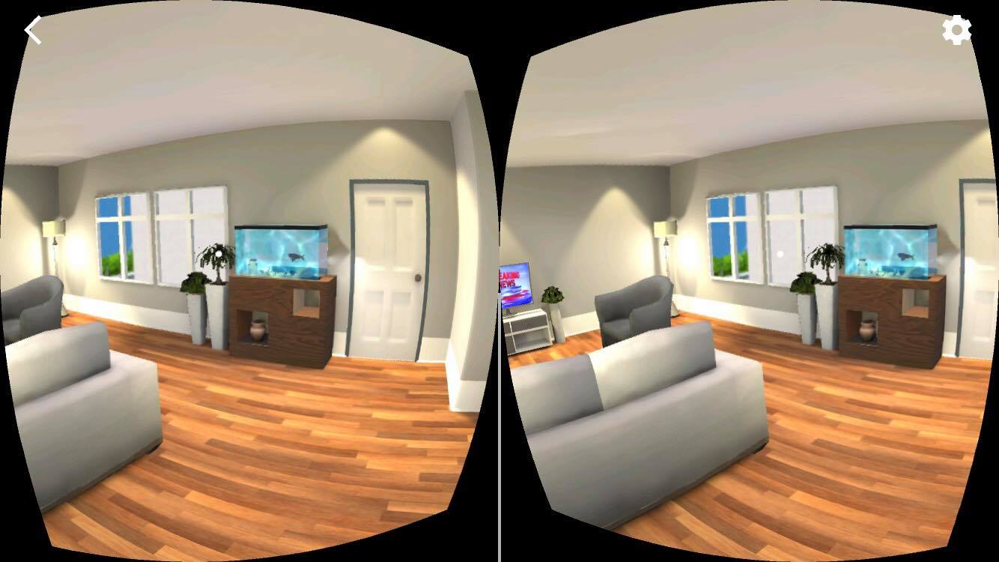

# Build an Apartment
By Rosaline Cabrera
Starter project for the Udacity [VR Developer Nanodegree](http://udacity.com/vr) program.

- Course: VR Scenes & Objects
- Project: Build an Apartment
- Target Device: iOS

## About

Welcome to this interactive apartment, decorated with the "transitional minimanist" in mind. Click on the globe to make it spin or stop. Click anywhere in the apartment to watch segments of some breaking news clip from the television. Or watch as the pet fish, Nemo, swims curiously in his tank. 

## Reflection
There were several aspects about this project that I found challenging, but ultimately worth it all. Perhaps the most challenging part was figuring out a nice and simple apartment design with free assets. Due to those limitations, I custom built several GameObject prefabs, such as the kitchen lamps hanging on both sides of the range (above the oven) and the fish tank. One of my favorite tasks was figuring out how to code some of the animation or make it work using the animation controller. The scene has at least 3 different animations with 3 different styles. For example, the fish is a "position" animation. The globe is a "rotation" animation that uses boolean triggers to turn on and off. And the TV images rotate every time the player teleports via the TextureSwap.cs script.

### 3rd Party Assets
[Low Poly Fish and Tank Accessories by Acorn Bringer](https://assetstore.unity.com/publishers/2136)
[Bar Char 2 by HarpetStudio](https://www.artstation.com/harpet)
[Low Poly Light Bulb by Jason Toff](https://poly.google.com/view/4TkYCZMlbS6)
[Various textures by Google Images](https://www.google.com/imghp?hl=en&tab=wi&authuser=0&ogbl)
[Cutlery by Devotid](http://www.devotid.com/assets/)
[Kitchen Creation Kit by Studio Krokidana](https://assetstore.unity.com/publishers/132)
[Lamps by Funfant](www.funfant.net )
[Pizza by Maksim Bugrimov](https://assetstore.unity.com/publishers/6845)
[Plants by Nobiax/Yughues](https://assetstore.unity.com/publishers/4986)
[Toon Furniture by Elcanetay](https://assetstore.unity.com/publishers/15563)
[White Procelain Dish Set Demo](https://assetstore.unity.com/publishers/27037)
[City Traffic sound byte by PacDV](https://www.pacdv.com/sounds/ambience_sounds.html)

### Versions Used
- [Unity LTS Release 2017.4.15](https://unity3d.com/unity/qa/lts-releases?version=2017.4)
- [GVR SDK for Unity v1.170.0](https://github.com/googlevr/gvr-unity-sdk/releases/tag/v1.170.0)

### Directory Structure
- The Unity project is the child directory of the repository and named according to the associated lesson.
- The Unity project is 'cleaned' and includes the `Assets` folder, the `ProjectSettings` folder, and the `UnityPackageManager` folder.

### GVR SDK for Unity
- `GoogleVR` > `Demos` is not included.
- `GoogleVR` > `GVRVideoPlayer.unitypackage` is included.
- Scripts applicable to the course have been updated to reflect Unity's API change from `UnityEngine.VR` to `UnityEngine.XR`.

>**Note:** If for any reason you remove and re-import GVR SDK for Unity v1.170.0, make sure you accept any API update pop-up prompts triggered by Unity. Alternatively, you can manually run the API updater (Unity menu `Assets` > `Run API Updater...`) after the import has completed.

### Related Repositories
- [VR Scenes and Objects - Game Objects](https://github.com/udacity/VR-Scenes-and-Objects_Game-Objects/releases)
- [VR Scenes and Objects - Animations](https://github.com/udacity/VR-Scenes-and-Objects_Animations/releases)
- [VR Scenes and Objects - Cameras](https://github.com/udacity/VR-Scenes-and-Objects_Cameras/releases)
- [VR Scenes and Objects - Lights](https://github.com/udacity/VR-Scenes-and-Objects_Lights/releases)
- VR Scenes and Objects - Build an Apartment

