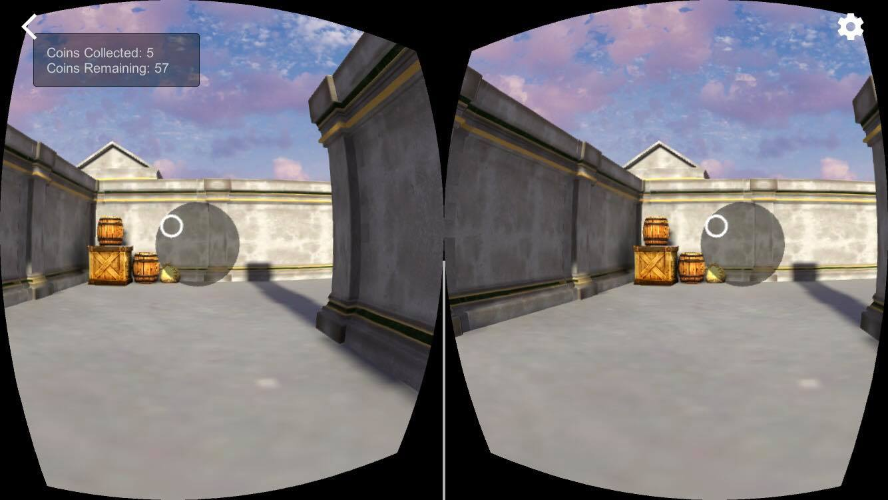
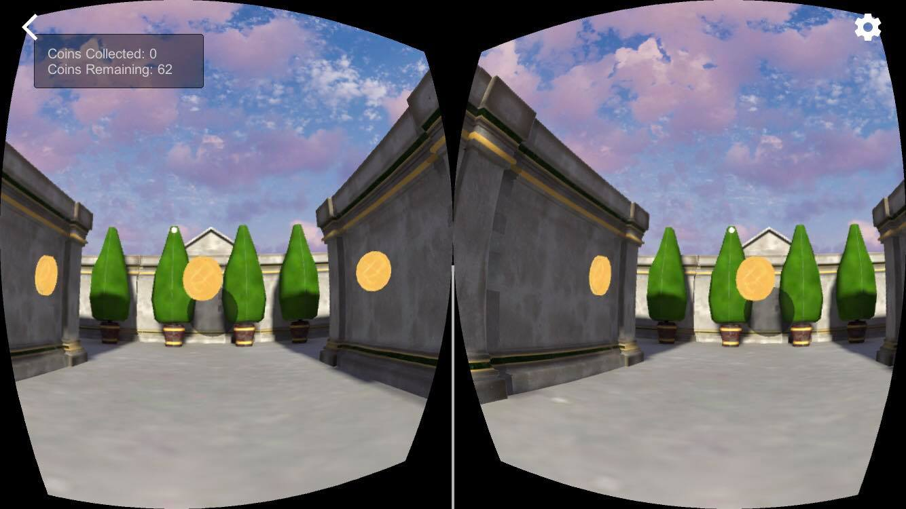
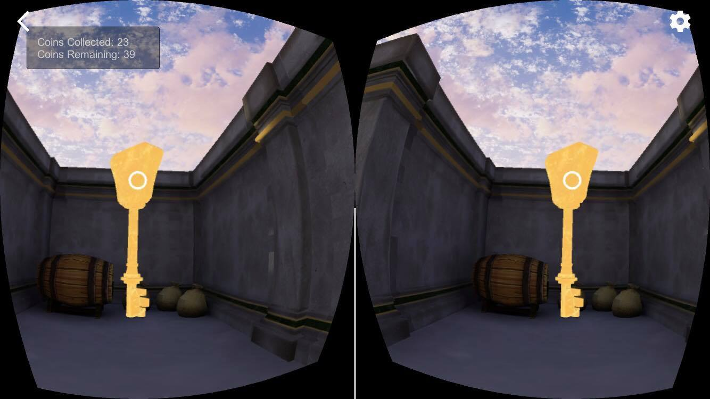
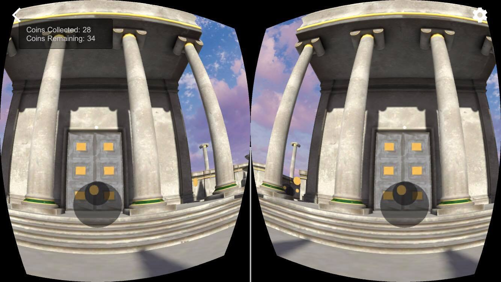
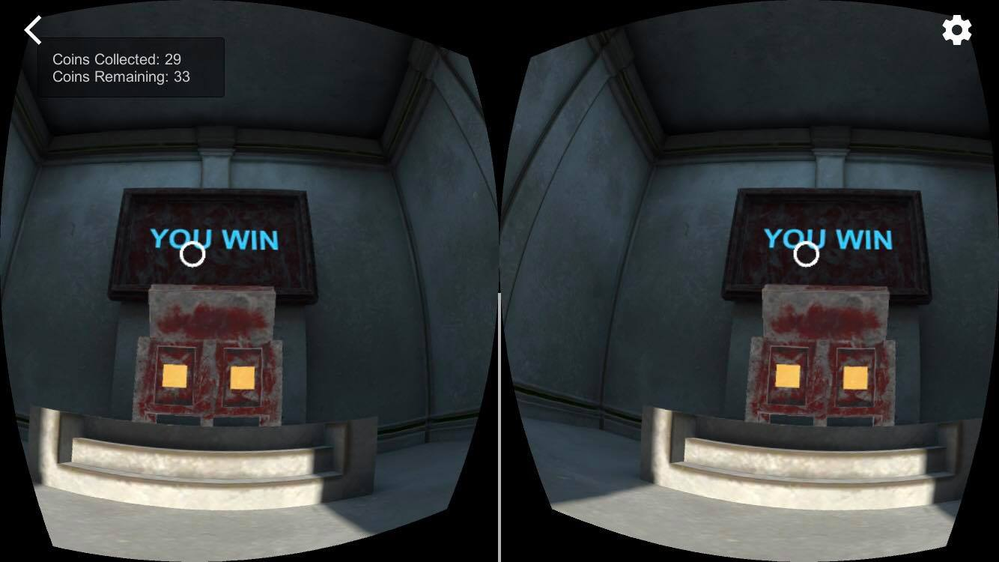

# A Maze
By Rosaline Cabrera \
Project for the Udacity [VR Developer Nanodegree](http://udacity.com/vr) program.

- Course: VR Software Development
- Project: A Maze
- Target Device: iOS
- Main Scene: Assets > UdacityVR > Scenes > Main.unity

## About
Find your way into the Forbidden Temple. Collect coins along your journey, but don't forget the key!

## Screenshots
 \
 \
 \
 \

## Reflection
As the final project in the VR Developer Nanodegree program, everything we learned up until this point was put to the test: creating animation triggers, keeping a scoreboard and controlling objects with C# scripts, displaying the score via a simple UI, creating custom skyboxes, adding indoor/outdoor lighting and reflections, modifying Google SDK player controllers, managing GameObjects physics, and much more. 

## 3rd Party Assets
[AllSky Free by RPGWhiteLock](http://www.richardwhitelock.com) \
[RPG Puzzle Game Music by Red Iron Labs](https://www.redironlabs.com) \
[Casual Game Sounds by Dustyroom](http://dustyroom.com) \
[Fantasy Object free set by Piablood](http://blog.livedoor.jp/piablood/)

## Versions Used
- [Unity LTS Release 2017.4.15](https://unity3d.com/unity/qa/lts-releases?version=2017.4)
- [GVR SDK for Unity v1.170.0](https://github.com/googlevr/gvr-unity-sdk/releases/tag/v1.100.1)

## Project Structure
- All assets that needed to complete the project (according to the project rubric) have been imported.
- The imported models have been placed in the scene and organized in the scene hierarchy.
- Colliders have been added to the `Coin`, `Key`, `Left_Door`, `Right_Door`, and `The_Temple` game objects, and to the `Maze` game object's child game objects.

## Related Repositories
- [VR Software Development - Creating Scripts](https://github.com/udacity/VR-Software-Development_Creating-Scripts/releases)
- [VR Software Development - Controlling Objects Using Code](https://github.com/udacity/VR-Software-Development_Controlling-Objects-Using-Code/releases)
- [VR Software Development - VR Interaction](https://github.com/udacity/VR-Software-Development_VR-Interaction/releases)
- [VR Software Development - Programming Animations](https://github.com/udacity/VR-Software-Development_Programming-Animations/releases)
- [VR Software Development - Physics and Audio](https://github.com/udacity/VR-Software-Development_Physics-and-Audio/releases)
- [VR Software Development - Advanced VR Scripting](https://github.com/udacity/VR-Software-Development_Advanced-VR-Scripting/releases)
- VR Software Development - A Maze
